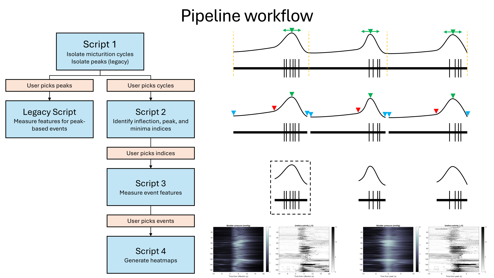

# cystometry_matlabscripts
MATLAB scripts used to analyze cystometry time series data collected from anesthetized mice

## Table of Contents
- [Analysis Pipeline Workflow](#workflow)
- [System Requirements & Installation](#install)
- [Usage Guide](#usage)
- [Known Issues & Bugs](#issues-bugs)
- [Authors, Acknowledgements, & Contact Information](#authors)
- [License](#license)

## Analysis Pipeline Workflow 
The custom cystometry analysis scripts 1-4 work in series to isolate pressure peak events during micturition cycles recorded using the AcqKnowledge software (v4.4.2, BIOPAC). Users have precise control over which micturition cycles and which peak events are analyzed in depending on how the time series data are indexed via the MATLAB scripts. Please refer to the workflow diagram for a visual summary.

     

## System Requirements & Installation
- The code was written and tested on a Windows 11 64-bit OS laptop running MATLAB v.2019B/2025B with 32 GB of RAM, AMD Ryzen 7 5800H 8 core CPU, and NVIDIA GeForce RTX 3070 GPU with 8 GB of VRAM
- Required MATLAB Products/Packages: Signal Processing Toolbox
- Follow standard MATLAB program installation instructions, install the Signal Processing Toolbox, and place the cystometry analysis scripts 1-4 in your path location of choice

## Usage Guide 
Before you begin, make sure to adjust any global variables to best fit your data parameters (e.g., SampleRate). These variables can be found within the first 30 lines of each script. Also, make sure to update the path variable and filetype filters in each script to match your folder destination of choice.
- Script 1: Lines 8 and 20
- Script 2: Lines 7 and 18
- Script 3: Lines 7, 20, and 27
- Script 4: Lines 7 and 33

### Script 1
1. Load the MATLAB-converted AcqkKnowledge data (.mat filetype)
   - Assumes pressure time series data are stored in column 1 (see line 37)
   - Assumes corresponding electromyography time series data are stored in column 2 (see line 38)
2. You will be presented with the pressure time series, but inverted, to facilitate isolating local micturition cycle minima
   - Enter the pressure threshold used to detect local micturition cycle minima (enter a negative pressure value)
   - Enter the minimal time interval between local micturition cycle minima (enter a time in seconds)
   - Enter the minimum pressure amplitude for local micturition cycle minima (enter a positive pressure value)
3. You will be shown the results of MATLAB's findpeaks function
   - Enter 1 to accept (proceed to step 4)
   - Enter 0 to not accept (step 2 will repeat)
4. You will be presented with the pressure time series to facilitate isolating peak pressure events
   - Enter the pressure threshold used to detect peak pressure events (enter a positive pressure value)
   - Enter the minimal time interval between peak pressure events (enter a time in seconds)
   - Enter the minimum pressure amplitude for peak pressure events (enter a positive pressure value)
5. You will be shown the results of MATLAB's findpeaks function
   - Enter 1 to accept (proceed to step 6)
   - Enter 0 to not accept (step 4 will repeat)
6. Script will run to completion

### Script 2
1. Load the MATLAB-converted AcqKnowledge data (.mat filetype)
   - Assumes pressure time series data are stored in column 1 (see line 35)
   - Corresponding electromyography time series data are not used
2. Load the "unitary" event files that correspond to the micturition cycles to be analyzed (.mat filetype)
   - Select 1 or more files that end with "_unitary_NUMBER.mat" that correspond with the time series data selected in step 1
   - These files were generated via Script 1
3. You will be presented with the pressure time series, but inverted, to facilitate isolating local micturition cycle minima
   - Enter the pressure threshold used to detect local micturition cycle minima (enter a negative pressure value)
   - Enter the minimal time interval between local micturition cycle minima (enter a time in seconds)
   - Enter the minimum pressure amplitude for local micturition cycle minima (enter a positive pressure value)
4. You will be shown the results of MATLAB's findpeaks function
   - Enter 1 to accept (proceed to step 5)
   - Enter 0 to not accept (step 3 will repeat)
5. You will be presented with the pressure time series to facilitate isolating non-voiding AND voiding pressure events
   - Enter the pressure threshold used to detect pressure events (enter a positive pressure value)
   - Enter the minimal time interval between pressure events (enter a time in seconds)
   - Enter the minimum pressure amplitude for pressure events (enter a positive pressure value)
6. You will be shown the results of MATLAB's findpeaks function
   - Enter 1 to accept (proceed to step 7)
   - Enter 0 to not accept (step 5 will repeat)
7. You will be presented with the pressure time series, but inverted, to facilitate isolating local minima that separate non-voiding and voiding pressure events
   - Enter the pressure threshold used to detect local minima (enter a negative pressure value)
   - Enter the minimal time interval between local minima (enter a time in seconds)
   - Enter the minimum pressure amplitude for local minima (enter a positive pressure value)
8. You will be shown the results of MATLAB's findpeaks function
   - Enter 1 to accept (proceed to step 9)
   - Enter 0 to not accept (step 8 will repeat)
9. Script will run to completion

### Prior to Script 3
1. Download the template unitary events index table (.xlsx filetype)
2. Inspect the images generated by Script 2 with filenames that end with "...plotDerivsMinimaPeaks.jpg", and for each micturition cycle, select the following:
   - The number of subevents you want to isolate (can be non-voiding, voiding, or a combination of both)
   - For each subevent, select the following:
     - Start Index Type ("D" for derivative, "M" for minima)
     - Start Index Number
     - End Index Type ("D" for derivative, "M" for minima)
     - End Index Number
     - Peak Index Number (enter "0" if no detected peak for event)
3. With the information collected in step 2, fill in the template as follows (1 subevent per row):
   - Column 1 = full filename for the corresponding micturition cycle file (the .mat filetype)
   - Column 2 = full filename for the corresponding file that ends in "...pressure3rdDerivPeaks" (the .xlsx filetype)
   - Column 3 = full filename for the corresponding file that ends in "...pressureMinima" (the .xlsx filetype)
   - Column 4 = full filename for the corresponding file that ends in "...pressurePeaks" (the .xlsx filetype)
   - Column 5 = mouse sex (determines how electromyography data are analyzed)
   - Column 6 = number that corresponds to column 1
   - Columns 7-12 = fill in the information from step 2
4. Save the index table in your root folder, it will be used during Script 3

### Script 3

### Script 4

## Known Issues & Bugs 
- **PLACEHOLDER BULLET LIST**
- **PLACEHOLDER BULLET LIST**

## Authors, Acknowledgements, & Contact Information 
The cystometry analysis scripts were written by Max Odem; legacy version of script 1 was written by Jason Keller, Kara Marshall, and Max Odem. All source code, documentation, and assets in this repository were created manually. No generative artificial intelligence tools were used to design, write, modify, or debug the code.

This work was made possible through the following funding sources:
- Howard Hughes Medical Institute Freeman Hrabowski Scholars Program (KLM)
- National Institutes of Health R00DK128621 (KLM) and R01DK142807-01 (KLM)
- McNair Medical Foundation (KLM)
- Pew Charitable Trusts (KLM)
- Rita Allen Foundation (KLM)

For technical support please contact [Max (BCM)](mailto:max.odem@bcm.edu)/[Max (private)](mailto:max.neuro.odem@gmail.com). For all other inquires please contact [Kara Marshall (BCM)](mailto:kara.marshall@bcm.edu).

## License 
Copyright 2026 Baylor College of Medicine

The cystometry analysis code is licensed under the Apache License, Version 2.0 (the "License");
you may not use this file except in compliance with the License.
You may obtain a copy of the License at

     http://www.apache.org/licenses/LICENSE-2.0

 Unless required by applicable law or agreed to in writing, software
 distributed under the License is distributed on an "AS IS" BASIS,
 WITHOUT WARRANTIES OR CONDITIONS OF ANY KIND, either express or implied.
 See the License for the specific language governing permissions and
 limitations under the License.
